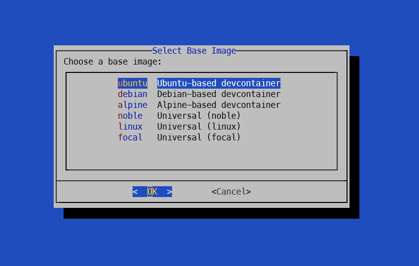

# Devcontainer Composer

`devcontainer-compose.sh` is a terminal-based wizard that scaffolds new project directories using [Dev Container](https://containers.dev) features. The script guides you through selecting a base image, choosing optional features from GitHub, and writing a `.devcontainer/devcontainer.json` file with all of your selections.



---

## Features

- **Interactive dialogs** — uses `dialog` to walk you through each step in a full‑screen terminal UI
- **Base image selection** — choose from Ubuntu, Debian, Alpine, or universal images and pick a specific tag
- **GitHub features** — discover features from GitHub repositories, configure their options, and automatically pull in dependencies
- **Dependency resolution** — any `dependsOn` entries from selected features are added for you
- **Project bootstrapping** — creates a project folder, writes a ready‑to‑use `devcontainer.json`, and initializes a Git repository

---

## Prerequisites

Install the following utilities on your system:

- `bash`
- `dialog`
- `jq`
- `git`
- `curl`

The script will offer to install missing packages automatically if you use a supported package manager (`apt`, `yum`, or `brew`).

---

## Quick Start

```bash
./devcontainer-compose.sh
```

You will be prompted to:

1. Select a base image and tag.
2. Pick features from the available GitHub repositories.
3. Provide the destination directory and project name.

After completion you will have a directory containing:

```text
my-project/
└─ .devcontainer/
   └─ devcontainer.json
```

The new project is also initialized as a Git repository with the first commit.

---

## Example `devcontainer.json`

```json
{
  "image": "mcr.microsoft.com/devcontainers/base:ubuntu-22.04",
  "features": {
    "ghcr.io/devcontainers/features/docker:1": {},
    "ghcr.io/devcontainers/features/aws-cli:1": {}
  }
}
```

---

## Screenshots

Screenshots of the dialog interface are located in the `assets/` folder:

- `composer1.png` – base image selection
- `composer2.png` – feature checklist
- `composer3.png` – project location prompt

They give a sense of the flow if you haven’t run the script yet.

---

## License

This project is licensed under the MIT License.
